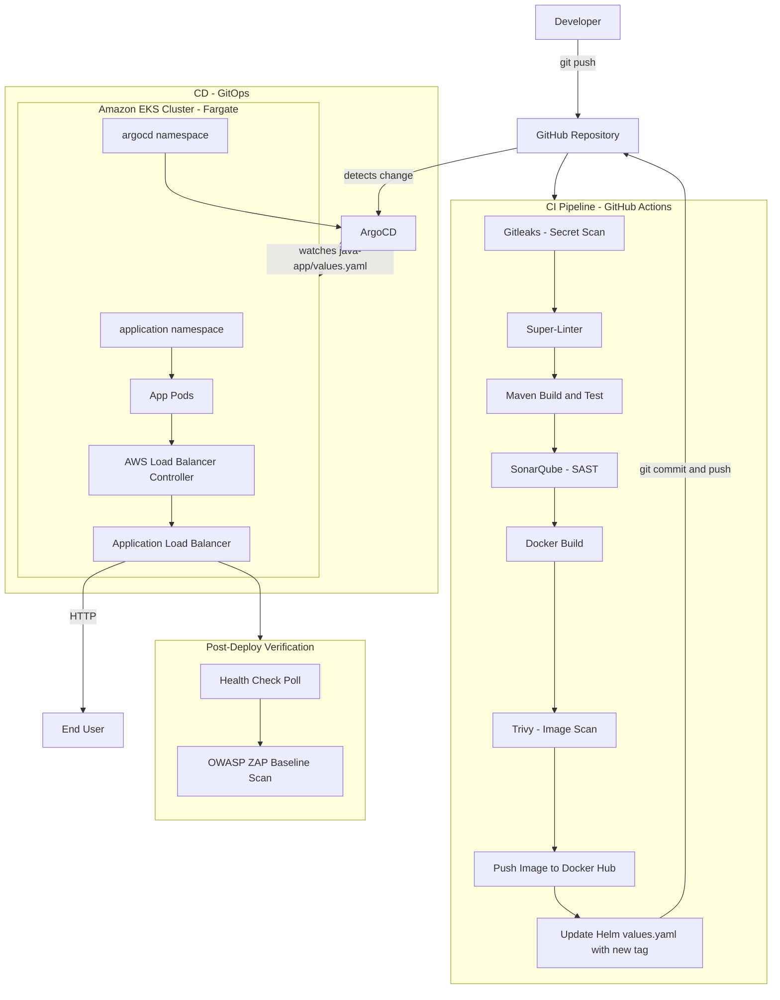

# Java DevSecOps CI/CD Pipeline

## Introduction

This project demonstrates an end-to-end **DevSecOps CI/CD pipeline** for a Java application, built to showcase how security can be embedded at every stage of the software delivery lifecycle rather than bolted on at the end.

Starting from a simple Java application, the project walks through containerizing it, automating build/test/security checks through GitHub Actions, and deploying it to a production-grade environment on **Amazon EKS** using the **GitOps** methodology with **ArgoCD**.

The core idea behind this project is "shift-left security" — catching vulnerabilities and misconfigurations as early as possible:

- **Secret scanning** and **linting** before any code is built
- **Static code analysis** and **dependency/image vulnerability scanning** during the build
- **Dynamic security testing** against the live, deployed application

### What This Project Covers

1. **Local Development & Testing** — Building and running the Java application locally to validate it before containerization.
2. **Containerization** — A multi-stage, distroless Docker build for a minimal, secure runtime image.
3. **CI/CD Automation** — A GitHub Actions pipeline that lints, builds, tests, scans, and pushes the application automatically.
4. **GitOps Deployment** — ArgoCD continuously syncs the desired state from this repository to the Kubernetes cluster.
5. **Cloud Infrastructure** — An Amazon EKS cluster (Fargate) hosting the application, exposed via the AWS Load Balancer Controller.

### Tech Stack

| Category | Tools |
|---|---|
| Language / Build | Java 17, Maven |
| Containerization | Docker (multi-stage, distroless) |
| CI/CD | GitHub Actions |
| Code Quality & Security | Gitleaks, Super-Linter, SonarQube, Trivy, OWASP ZAP |
| Container Registry | Docker Hub |
| Orchestration | Amazon EKS (Fargate) |
| GitOps / Deployment | ArgoCD |
| Networking | AWS Load Balancer Controller (ALB) |

## Architecture

The diagram below shows how a code change flows from a developer's machine to a running, internet-facing service on EKS.



**Flow summary:**

1. A developer pushes code to the GitHub repository.
2. GitHub Actions runs the DevSecOps pipeline — secret scanning, linting, build/test, static analysis, Docker build, image vulnerability scanning, and pushes the image to Docker Hub.
3. The pipeline updates the image tag in `java-app/values.yaml` and commits it back to the repo.
4. ArgoCD, running in the `argocd` namespace on EKS, detects the change and syncs the new version into the `application` namespace (GitOps).
5. The AWS Load Balancer Controller provisions/updates an ALB, routing external traffic to the application pods.
6. Post-deployment, the pipeline verifies the app is healthy and runs an OWASP ZAP scan against the live ALB endpoint.

### Project Journey

The project was built incrementally, validating each layer before moving to the next:

1. **Local testing** — Verified the application ran correctly before introducing any automation:

   ```bash
   mvn dependency:go-offline
   mvn clean package -DskipTests
   java -jar target/app.jar
   mvn test
   ```

2. **Containerization** — Created a multi-stage, distroless [`Dockerfile`](./Dockerfile) to package the application into a minimal, secure runtime image.

3. **Kubernetes manifests** — Wrote the core `deployment.yml`, `service.yml`, and `ingress.yml` manifests to define how the application runs and is exposed inside the cluster.

4. **Helm chart** — Converted the manifests into a Helm chart using `helm create <chart-name>`, making the deployment configurable and versioned via `values.yaml`.

5. **CI pipeline** — Built out the GitHub Actions pipeline covering secret scanning, linting, build/test, static analysis, Docker image build and scanning, and the automated Helm tag update (`gitleaks` → `lint` → `build-test-analyse` → `docker` → `update-tag`).

6. **EKS & ArgoCD setup** — Provisioned the Amazon EKS cluster and installed ArgoCD to continuously sync the Helm chart from this repository to the cluster (GitOps).

7. **DAST** — Added a final pipeline stage to verify the live deployment's health and run an OWASP ZAP baseline scan against the running application.

### Repository Structure

```
.
├── .github/workflows/   # CI/CD pipeline definitions (see README in this folder)
├── java-app/            # Helm chart / K8s manifests + EKS & ArgoCD setup (see README in this folder)
├── kubernetes/          # Kubernetes-related resources
├── src/                 # Java application source code
├── Dockerfile           # Multi-stage, distroless Docker build
├── application.yaml     # ArgoCD Application manifest
├── iam_policy.json       # IAM policy for AWS Load Balancer Controller
└── pom.xml              # Maven project configuration
```

### Documentation

This README covers the project overview, architecture, and journey. Two areas are documented in more depth in their own READMEs, linked in context below:

- The CI pipeline (stages `gitleaks` → `lint` → `build-test-analyse` → `docker` → `update-tag` → `dast`, required secrets/variables, and the tools used) is explained in detail in **[`.github/workflows/README.md`](.github/workflows/README.md)**.
- Provisioning the EKS cluster, installing ArgoCD, and setting up the AWS Load Balancer Controller to expose the app is explained step-by-step in **[`java-app/README.md`](java-app/README.md)**.

### Resources Followed

- [Amazon EKS Documentation](https://docs.aws.amazon.com/eks/latest/userguide/what-is-eks.html)
- [GitHub Actions Marketplace](https://github.com/marketplace?type=actions)
- [ArgoCD Getting Started Guide](https://argo-cd.readthedocs.io/en/stable/getting_started/)

## Conclusion

This project brings together application development, containerization, automated security tooling, and cloud-native deployment into a single, cohesive pipeline. By integrating secret scanning, static analysis, container image scanning, and dynamic application security testing directly into the CI/CD workflow, security becomes a continuous, automated part of delivery rather than a manual, after-the-fact process.

Pairing this with a GitOps deployment model via ArgoCD ensures that the state of the Kubernetes cluster always reflects what's committed to the repository, making deployments predictable, auditable, and easy to roll back if needed.

Overall, this project serves as a practical reference for building a secure, automated, and cloud-native delivery pipeline for a Java application — from a developer's first `mvn test` all the way to a running, internet-facing service on Amazon EKS.